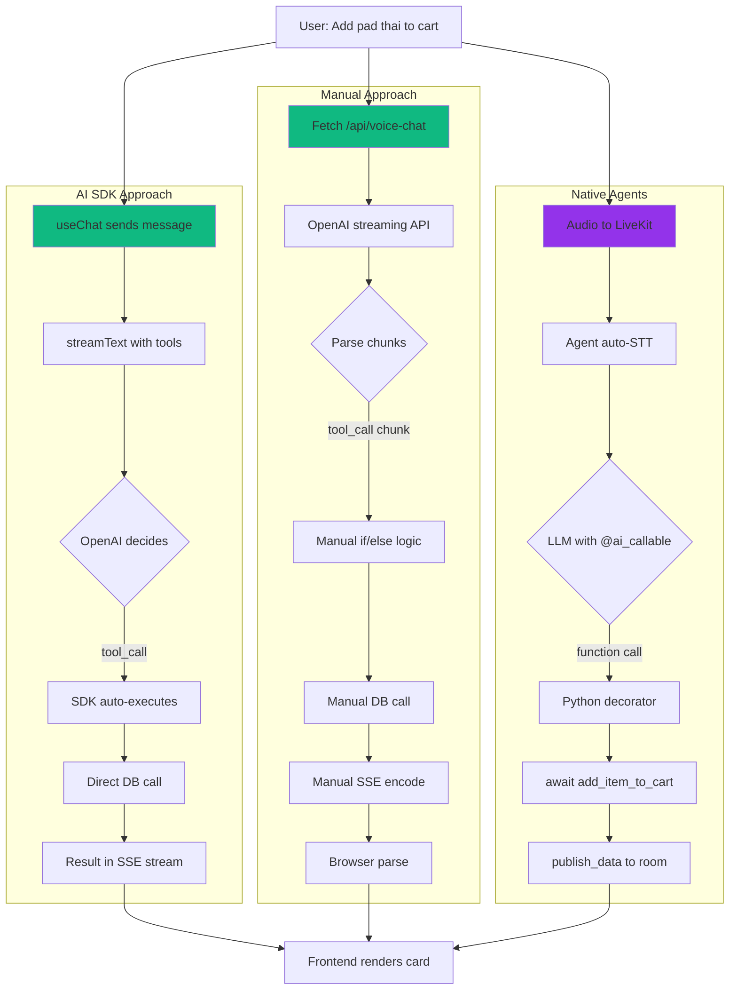

# Visual Diagrams for Voice Agent Architectures

This document contains Mermaid diagrams that can be:
1. Rendered in GitHub/VS Code
2. Exported to PNG/SVG
3. Recreated in Lucidchart for presentations
4. Used in video overlays

---

## 🎨 System Architecture Overview

### All Three Approaches Side-by-Side

```mermaid
graph TB
    subgraph "1. AI SDK Approach"
        U1[User Browser]
        A1[Next.js API /api/chat]
        V1[Vercel AI SDK]
        O1[OpenAI GPT-4]
        D1[(Supabase)]
        
        U1 -->|useChat hook| A1
        A1 -->|streamText| V1
        V1 -->|Tool execution| O1
        V1 -->|Auto-execute| D1
        O1 -->|SSE stream| U1
    end
    
    subgraph "2. Manual LiveKit"
        U2[User Browser]
        L2[LiveKit Room]
        A2[Next.js API /api/voice-chat]
        O2[OpenAI API]
        D2[(Supabase)]
        
        U2 -->|Connect| L2
        U2 -->|Fetch SSE| A2
        A2 -->|Manual parse| O2
        A2 -->|Manual execute| D2
        O2 -->|Custom SSE| U2
    end
    
    subgraph "3. Native Agents"
        U3[User Browser]
        L3[LiveKit Room]
        P3[Python Agent]
        O3[OpenAI STT/LLM/TTS]
        D3[(Supabase)]
        
        U3 -->|Audio track| L3
        L3 -->|Auto-join| P3
        P3 -->|@ai_callable| O3
        P3 -->|Execute function| D3
        P3 -->|Audio + data| U3
    end
    
    style U1 fill:#10b981
    style U2 fill:#10b981
    style U3 fill:#9333ea
```

---

## 🔄 Request Flow Comparison

### Architecture 1: AI SDK Flow


### Architecture 2: Manual LiveKit Flow

```mermaid
sequenceDiagram
    autonumber
    actor User
    participant Browser
    participant LK as LiveKit Room
    participant API as Next.js API<br/>/api/voice-chat
    participant OpenAI
    participant DB as Supabase

    User->>Browser: Clicks "Start"
    Browser->>API: POST /api/livekit/token
    API-->>Browser: JWT token
    Browser->>LK: Connect to room
    LK-->>Browser: Connected
    
    User->>Browser: Speaks: "Add pad thai"
    Browser->>API: POST with audio/text
    API->>OpenAI: Whisper STT
    OpenAI-->>API: Transcription
    API->>OpenAI: Chat completion (streaming)
    
    Note over OpenAI: Decides to call<br/>addItemToCart
    
    loop Manual SSE Parsing
        OpenAI-->>API: Delta chunks
        API->>API: Parse tool_calls
        alt Tool call detected
            API->>DB: Execute tool manually
            DB-->>API: Cart updated
            API-->>Browser: data: {"type":"tool-output"}
        else Text delta
            API-->>Browser: data: {"type":"text-delta"}
        end
    end
    
    Browser->>Browser: Manual chunk parsing
    Browser-->>User: Renders cart card
    
    Note over Browser,User: ⚠️ Total time: ~800ms<br/>+ manual parsing overhead
```



### Architecture 3: Native LiveKit Agents Flow


---

## 🏛️ Component Architecture

### Frontend Components (All Approaches)


### Backend Architecture

```mermaid
graph TB
    subgraph "Next.js Backend"
        Route1[/api/chat<br/>AI SDK]
        Route2[/api/voice-chat<br/>Manual]
        Route3[/api/livekit-native/token<br/>Token Gen]
        
        Route1 --> SDK[Vercel AI SDK]
        Route2 --> Manual[Manual OpenAI]
        Route3 --> LKToken[LiveKit JWT]
    end
    
    subgraph "Python Backend"
        Agent[food_concierge_native.py]
        DB_Layer[database.py]
        Tools[Tool Functions]
        
        Agent --> DB_Layer
        Agent --> Tools
    end
    
    subgraph "External Services"
        OpenAI_API[OpenAI API]
        LiveKit_Cloud[LiveKit Cloud]
        Supabase_DB[(Supabase)]
    end
    
    SDK --> OpenAI_API
    Manual --> OpenAI_API
    Agent --> OpenAI_API
    Agent --> LiveKit_Cloud
    Route3 --> LiveKit_Cloud
    
    SDK --> Supabase_DB
    Manual --> Supabase_DB
    DB_Layer --> Supabase_DB
    
    style Agent fill:#9333ea
    style Route1 fill:#10b981
    style Route2 fill:#10b981
```

---

## 🔧 Tool Execution Flow

### How Each Approach Handles "Add to Cart"



---

## 📊 Performance Comparison

### Latency Breakdown

```mermaid
gantt
    title Voice Response Latency (User speaks → Audio plays)
    dateFormat X
    axisFormat %L ms
    
    section AI SDK
    Browser STT     :a1, 0, 300
    Network         :a2, after a1, 100
    LLM Processing  :a3, after a2, 400
    Browser TTS     :a4, after a3, 300
    Total 1100ms    :milestone, after a4, 0
    
    section Manual LiveKit
    API STT         :b1, 0, 300
    Network         :b2, after b1, 100
    LLM Processing  :b3, after b2, 400
    Parsing         :b4, after b3, 100
    API TTS         :b5, after b4, 300
    Total 1200ms    :milestone, after b5, 0
    
    section Native Agents
    LiveKit STT     :c1, 0, 100
    LLM Processing  :c2, after c1, 200
    LiveKit TTS     :c3, after c2, 100
    Total 400ms     :milestone, after c3, 0
```



### Tool Execution Complexity

```mermaid
graph LR
    subgraph "Lines of Code"
        AI[AI SDK<br/>~50 LOC]
        Manual[Manual<br/>~300 LOC]
        Native[Native<br/>~100 LOC]
    end
    
    subgraph "Complexity"
        AI_C[Low<br/>Auto-handled]
        Manual_C[High<br/>Manual parsing]
        Native_C[Low<br/>Decorators]
    end
    
    subgraph "Developer Experience"
        AI_DX[⭐⭐⭐⭐⭐<br/>Excellent]
        Manual_DX[⭐⭐⭐<br/>Moderate]
        Native_DX[⭐⭐⭐⭐<br/>Great]
    end
    
    AI -.-> AI_C -.-> AI_DX
    Manual -.-> Manual_C -.-> Manual_DX
    Native -.-> Native_C -.-> Native_DX
    
    style AI fill:#10b981
    style Manual fill:#f59e0b
    style Native fill:#9333ea
```



---

## 🎯 Decision Tree

### Which Architecture Should You Choose?

```mermaid
graph TD
    Start{What's your<br/>primary interface?}
    
    Start -->|Text chat| Text{Voice support?}
    Start -->|Voice| Voice{Latency critical?}
    
    Text -->|Optional| AI[✅ AI SDK Approach<br/>Simple, fast development]
    Text -->|Primary| Voice
    
    Voice -->|Yes < 500ms| Native[✅ Native Agents<br/>Best voice experience]
    Voice -->|No| Control{Need custom<br/>control?}
    
    Control -->|Yes| Manual[✅ Manual LiveKit<br/>Full flexibility]
    Control -->|No| Native
    
    AI --> Team1{Team skills?}
    Manual --> Team2{Team skills?}
    Native --> Team3{Team skills?}
    
    Team1 -->|TypeScript| AI_Final[Perfect fit!]
    Team1 -->|Mixed| AI_Final
    
    Team2 -->|TypeScript| Manual_Final[Good choice]
    Team2 -->|Mixed| Manual_Warning[Complex but flexible]
    
    Team3 -->|Python| Native_Final[Perfect fit!]
    Team3 -->|TypeScript only| Native_Warning[Learn Python or<br/>use AI SDK]
    
    style AI fill:#10b981
    style Manual fill:#f59e0b
    style Native fill:#9333ea
```



---

## 🚀 Deployment Architecture

### Production Setup


---

## 📦 Package Dependencies

### Frontend Dependencies

```mermaid
graph LR
    subgraph "All Approaches"
        React[react ^18.3.0]
        Next[next ^16.0.1]
        Tailwind[tailwindcss ^3.4.0]
    end
    
    subgraph "AI SDK Specific"
        AI_SDK[@ai-sdk/react ^2.0.82]
        AI_OpenAI[@ai-sdk/openai ^2.0.58]
        AI_Core[ai ^5.0.82]
    end
    
    subgraph "LiveKit Specific"
        LK_Client[livekit-client ^2.17.1]
        LK_React[@livekit/components-react]
        LK_Server[livekit-server-sdk ^2.15.0]
    end
    
    React --> Next
    Next --> Tailwind
    Next --> AI_SDK
    Next --> LK_Client
    
    AI_SDK --> AI_Core
    AI_SDK --> AI_OpenAI
    
    LK_Client --> LK_React
    LK_Server --> Next
    
    style AI_SDK fill:#10b981
    style LK_Client fill:#9333ea
```

### Backend Dependencies (Python Agent)


---

## 🎬 Video Overlay Graphics

### Comparison Table (For Video)


---

## 🔍 Code Comparison

### Tool Definition Comparison


---

## 📱 User Experience Flow

### End-to-End User Journey


---

**Note**: These diagrams can be:
1. Copied into Lucidchart using their Mermaid import feature
2. Rendered in VS Code with Mermaid extension
3. Converted to PNG/SVG using `mermaid-cli`
4. Used directly in GitHub markdown

**Export Commands**:
```bash
# Install mermaid-cli
npm install -g @mermaid-js/mermaid-cli

# Convert to PNG
mmdc -i diagram.mmd -o diagram.png -b transparent

# Convert to SVG
mmdc -i diagram.mmd -o diagram.svg
```
