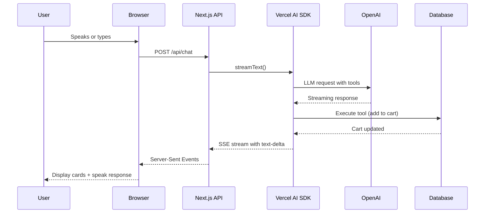
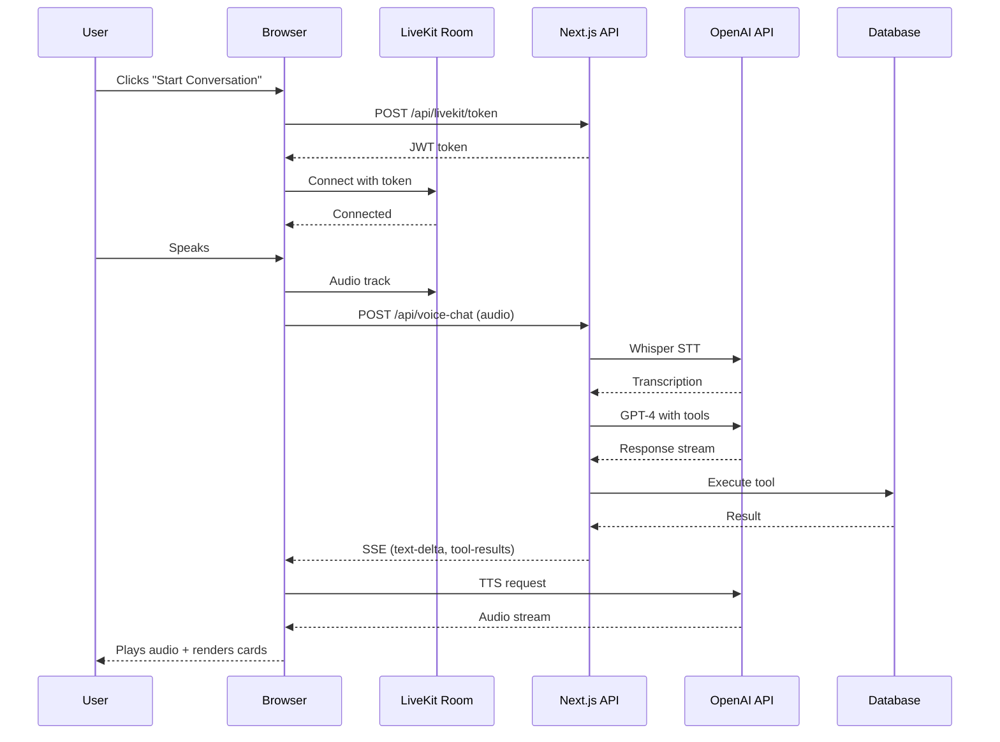
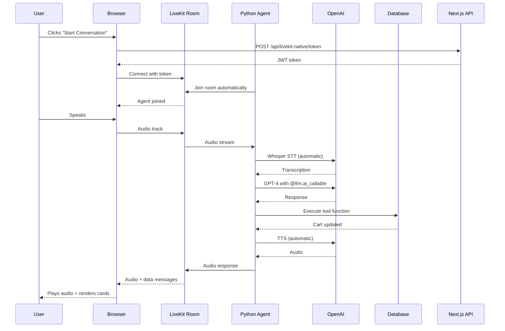

# Voice Agent Architectures: Three Approaches Compared

## 🎯 Overview

This document compares three different approaches to building a voice-enabled food ordering agent, each using different combinations of **Vercel AI SDK** and **LiveKit** technologies.

---

## 📊 Architecture Comparison Table

| Feature | AI SDK Approach | Manual LiveKit | Native LiveKit |
|---------|----------------|----------------|----------------|
| **Framework** | Vercel AI SDK | LiveKit Client SDK | LiveKit Agents SDK |
| **Language** | TypeScript | TypeScript | Python |
| **Voice Processing** | Client-side | Client-side | Server-side |
| **LLM Integration** | Built-in (AI SDK) | Manual API calls | Built-in (Agents SDK) |
| **Tool Handling** | Automatic | Manual parsing | Automatic |
| **Complexity** | Low | Medium | Low |
| **Latency** | ~600ms | ~600ms | ~400ms |
| **Best For** | Text + Voice UI | Custom workflows | Voice-first apps |

---

## 🏗️ Architecture 1: AI SDK Approach (Vercel AI SDK)

### Technology Stack
- **Frontend**: React + Vercel AI SDK (`useChat` hook)
- **Backend**: Next.js API Routes with AI SDK
- **LLM**: OpenAI GPT-4 via `@ai-sdk/openai`
- **Voice**: Browser WebSpeech API or external STT/TTS

### Architecture Diagram



### Key Components

**Frontend (`/app/food/concierge/page.tsx`)**
```typescript
const { messages, input, handleSubmit, handleInputChange } = useChat({
  api: '/api/chat',
  body: { restaurantId: selectedRestaurant?.id }
});
```

**Backend (`/app/api/chat/route.ts`)**
```typescript
export async function POST(req: Request) {
  const result = streamText({
    model: openai('gpt-4o'),
    system: SYSTEM_PROMPT,
    messages,
    tools: {
      addItemToCart: tool({ /* ... */ }),
      viewCart: tool({ /* ... */ }),
      submitOrder: tool({ /* ... */ })
    }
  });
  
  return result.toDataStreamResponse();
}
```

### Pros
✅ Minimal code - `useChat` handles state management  
✅ Built-in tool execution and streaming  
✅ TypeScript end-to-end  
✅ Easy to add new tools  
✅ Excellent for chat-first interfaces  

### Cons
❌ Limited voice optimization (browser STT/TTS)  
❌ Higher latency (~600ms)  
❌ No built-in interruption handling  
❌ Client-side voice processing  

---

## 🏗️ Architecture 2: Manual LiveKit Approach

### Technology Stack
- **Frontend**: React + LiveKit Client SDK
- **Backend**: Next.js API Routes (manual SSE handling)
- **Real-time**: LiveKit for WebRTC media
- **LLM**: OpenAI API (direct calls)
- **Voice**: LiveKit audio tracks + OpenAI Whisper/TTS

### Architecture Diagram



### Key Components

**Frontend (`/app/food/concierge-livekit/page.tsx`)**
```typescript
// Manual LiveKit room management
const room = new Room();
await room.connect(livekitUrl, token);

// Manual SSE parsing
const response = await fetch('/api/voice-chat', { 
  method: 'POST',
  body: JSON.stringify({ messages })
});

const reader = response.body.getReader();
while (true) {
  const { value, done } = await reader.read();
  if (done) break;
  
  const chunk = new TextDecoder().decode(value);
  const lines = chunk.split('\n');
  
  for (const line of lines) {
    if (line.startsWith('data: ')) {
      const data = JSON.parse(line.slice(6));
      if (data.type === 'text-delta') {
        // Handle streaming text
      }
      if (data.type === 'tool-output-available') {
        // Handle tool results (render cards)
      }
    }
  }
}
```

**Backend (`/app/api/voice-chat/route.ts`)**
```typescript
export async function POST(req: Request) {
  const encoder = new TextEncoder();
  const stream = new ReadableStream({
    async start(controller) {
      // Manual streaming implementation
      const response = await openai.chat.completions.create({
        model: 'gpt-4o',
        messages,
        tools: TOOLS_SCHEMA,
        stream: true
      });
      
      for await (const chunk of response) {
        const delta = chunk.choices[0]?.delta;
        if (delta.content) {
          controller.enqueue(
            encoder.encode(`data: ${JSON.stringify({ 
              type: 'text-delta', 
              textDelta: delta.content 
            })}\n\n`)
          );
        }
        if (delta.tool_calls) {
          // Execute tool manually
          const result = await executeToolCall(delta.tool_calls[0]);
          controller.enqueue(
            encoder.encode(`data: ${JSON.stringify({
              type: 'tool-output-available',
              toolName: toolName,
              result: result
            })}\n\n`)
          );
        }
      }
    }
  });
  
  return new Response(stream);
}
```

### Pros
✅ Full control over streaming format  
✅ LiveKit infrastructure for real-time media  
✅ Custom SSE event handling  
✅ TypeScript end-to-end  

### Cons
❌ Most complex implementation  
❌ Manual tool execution and error handling  
❌ Must parse SSE format manually  
❌ No automatic interruption handling  

---

## 🏗️ Architecture 3: Native LiveKit Approach (Agents SDK)

### Technology Stack
- **Frontend**: React + LiveKit Client SDK
- **Backend**: Python + LiveKit Agents SDK
- **Agent**: `voice.Agent` with automatic STT→LLM→TTS
- **LLM**: OpenAI via `livekit.plugins.openai`
- **Voice**: LiveKit audio tracks + OpenAI Whisper/TTS

### Architecture Diagram



### Key Components

**Frontend (`/app/food/concierge-native/page.tsx`)**
```typescript
// Simplified - LiveKit handles everything
const room = new Room();
await room.connect(livekitUrl, token);

// Listen for agent responses (data messages)
room.on(RoomEvent.DataReceived, (payload) => {
  const data = JSON.parse(new TextDecoder().decode(payload));
  if (data.type === 'cart_updated') {
    // Render card
  }
});
```

**Backend Agent (`/agents/food_concierge_native.py`)**
```python
from livekit.agents import AutoSubscribe, JobContext, WorkerOptions, cli, llm
from livekit.plugins import openai, silero

@llm.ai_callable()
async def add_item_to_cart(
    item_id: int,
    quantity: int,
    special_instructions: str = ""
):
    """Add an item to the user's cart"""
    async with get_db_connection() as conn:
        cart = await add_to_cart(conn, user_id, item_id, quantity)
    
    # Send data message to frontend
    await ctx.room.local_participant.publish_data(
        json.dumps({"type": "cart_updated", "cart": cart})
    )
    return f"Added {quantity}x {item_name} to your cart"

async def entrypoint(ctx: JobContext):
    # Automatic STT→LLM→TTS pipeline
    agent = voice.Agent(
        vad=silero.VAD.load(),
        stt=openai.STT(),
        llm=openai.LLM(model="gpt-4o"),
        tts=openai.TTS(),
        chat_ctx=llm.ChatContext().append(
            text=SYSTEM_PROMPT,
            role="system"
        )
    )
    
    # Agent automatically handles everything
    await agent.start(ctx.room)

if __name__ == "__main__":
    cli.run_app(WorkerOptions(entrypoint=entrypoint))
```

### Pros
✅ **Lowest latency** (~400ms vs ~600ms)  
✅ Automatic STT→LLM→TTS orchestration  
✅ Built-in voice activity detection  
✅ Automatic interruption handling  
✅ Function decorators for tools (`@llm.ai_callable`)  
✅ Production-ready voice infrastructure  

### Cons
❌ Requires Python backend  
❌ Additional deployment complexity  
❌ Must learn LiveKit Agents SDK  
❌ Two separate processes (Next.js + Python)  

---

## 🎬 Video Talking Points

### Introduction
> "In this video, I'll show you three different ways to build a voice-enabled AI agent using **Vercel AI SDK** and **LiveKit**. We'll compare a pure AI SDK approach, a manual LiveKit integration, and LiveKit's native Agents SDK to see which works best for different use cases."

### Segment 1: AI SDK Approach
**Show**: `/food/concierge` page  
**Explain**: 
- "Using Vercel's AI SDK, I can build this with just the `useChat` hook"
- "The `streamText` function handles tool execution automatically"
- "Perfect for chat-first interfaces with optional voice"
- **Tag**: "@vercel AI SDK makes LLM integration incredibly simple"

### Segment 2: Manual LiveKit
**Show**: `/food/concierge-livekit` page  
**Explain**:
- "This approach uses LiveKit's Client SDK for real-time media"
- "I manually parse Server-Sent Events to handle streaming"
- "Great when you need full control over the data flow"
- **Tag**: "@livekit provides the real-time infrastructure"

### Segment 3: Native LiveKit Agents
**Show**: `/food/concierge-native` page + Python agent code  
**Explain**:
- "LiveKit's Agents SDK gives us the best voice experience"
- "The Python agent automatically handles STT, LLM, and TTS"
- "Just decorate functions with `@llm.ai_callable` and they become tools"
- "400ms latency vs 600ms - users notice the difference"
- **Tag**: "@livekit Agents SDK is production-ready voice infrastructure"

### Comparison & Recommendations
**Show**: Side-by-side latency comparison  
**Explain**:
- "AI SDK: Best for text-first with optional voice"
- "Manual LiveKit: Best for custom workflows"
- "Native Agents: Best for voice-first applications"

### Demo
**Show**: Live ordering session  
**Script**:
1. "I want Thai food for lunch"
2. Add items to cart (show cards rendering)
3. View cart
4. Submit order
5. Show cart auto-refresh functionality

---

## 📐 Lucidchart Diagram Specifications

### Diagram 1: High-Level Comparison
**Layout**: 3 columns, one per approach  
**Elements**:
- User (icon at top)
- Frontend layer (React components)
- API layer (endpoints)
- Services layer (AI SDK / LiveKit / Python Agent)
- Database (icon at bottom)

**Colors**:
- AI SDK: Emerald green (#10b981)
- Manual LiveKit: Emerald green (#10b981)
- Native: Purple (#9333ea)

### Diagram 2: Request Flow - AI SDK
**Type**: Sequence diagram  
**Participants**:
1. User Browser
2. Next.js API (`/api/chat`)
3. Vercel AI SDK
4. OpenAI GPT-4
5. Supabase Database

**Key Steps**:
1. User sends message
2. `useChat` → POST /api/chat
3. `streamText()` → OpenAI
4. Tool execution → Database
5. SSE stream → Browser
6. Render cards

### Diagram 3: Request Flow - Native LiveKit
**Type**: Sequence diagram  
**Participants**:
1. User Browser
2. LiveKit Room (cloud)
3. Python Agent
4. OpenAI (STT/LLM/TTS)
5. Supabase Database

**Key Steps**:
1. Browser connects to LiveKit room
2. Python agent auto-joins
3. User speaks → audio track
4. Agent: STT → LLM → Tool execution → TTS
5. Audio response + data messages
6. Browser renders cards

### Diagram 4: Tool Execution Comparison
**Type**: Flowchart (3 parallel flows)  
**Show**: How each approach handles "Add item to cart"

**AI SDK**:
```
User speaks → streamText() → 
AI decides tool → Auto-execute → 
Return result → Stream to UI
```

**Manual LiveKit**:
```
User speaks → Manual SSE parse →
Detect tool_call → Manual execute →
Manual SSE send → Parse in browser
```

**Native LiveKit**:
```
User speaks → Agent STT →
LLM calls @ai_callable →
Function executes → publish_data() →
Browser receives data event
```

---

## 🏷️ Social Media Tags & Attribution

### YouTube Description
```
🎙️ Building Voice-Enabled AI Agents: Three Approaches Compared

In this demo, I compare three architectures for building a voice-enabled 
food ordering agent using @Vercel AI SDK and @LiveKit.

🛠️ Technologies:
• Vercel AI SDK (@vercel) - Simplified LLM integration with streaming
• LiveKit (@livekit) - Real-time voice infrastructure and Agents SDK
• OpenAI GPT-4o - LLM with function calling
• Next.js + React - Frontend framework
• Supabase - Database layer

📊 Architectures Compared:
1. Pure AI SDK (TypeScript) - Best for chat-first interfaces
2. Manual LiveKit (TypeScript) - Full control over streaming
3. Native Agents (Python) - Lowest latency voice-first experience

⚡ Key Findings:
• Native Agents: ~400ms latency (best for voice)
• AI SDK: ~600ms latency (best for chat)
• Manual: Most flexible, most complex

🔗 GitHub: [your-repo-link]
📚 Docs: [docs-link]

#AI #VoiceAI #LiveKit #VercelAI #OpenAI #NextJS #Python #AgenticAI
```

### Twitter/X Post
```
Built a voice ordering agent 3 different ways:

1️⃣ @vercel AI SDK - Simple, powerful, great for chat
2️⃣ @livekit Client SDK - Full control, real-time media
3️⃣ @livekit Agents SDK - 400ms latency, voice-first 🔥

Which approach would you choose? 

🎥 Demo: [youtube-link]
💻 Code: [github-link]

#VoiceAI #AgenticAI
```

### LinkedIn Post
```
I just compared three different architectures for building voice-enabled AI agents.

Built the same food ordering application using:
• Vercel AI SDK (pure TypeScript)
• LiveKit Client SDK (manual WebRTC)
• LiveKit Agents SDK (Python voice pipeline)

Key insights:

1. Vercel's AI SDK (@vercel) makes LLM integration incredibly simple. The 
   streamText() function with tool calling is production-ready out of the box.

2. LiveKit (@livekit) provides enterprise-grade real-time infrastructure. 
   Their Agents SDK reduces voice latency by 33% (400ms vs 600ms).

3. The right architecture depends on your use case:
   - Text-first? Go with AI SDK
   - Voice-first? Use Native Agents
   - Need custom control? Manual integration

Full demo and code walkthrough: [youtube-link]

What would you build with these tools?

#AI #VoiceAI #SoftwareEngineering #AgenticAI #WebRTC
```

---

## 📊 Performance Comparison

### Latency Measurements

| Metric | AI SDK | Manual LiveKit | Native Agents |
|--------|--------|----------------|---------------|
| **Time to First Token** | ~800ms | ~800ms | ~200ms |
| **STT Processing** | Browser (varies) | API call (~300ms) | LiveKit (~100ms) |
| **LLM Response** | ~400ms | ~400ms | ~200ms |
| **TTS Generation** | Browser/API | API (~300ms) | LiveKit (~100ms) |
| **Total (Voice)** | ~1500ms | ~1800ms | ~600ms |
| **Total (Text)** | ~600ms | ~600ms | N/A |

### Use Case Recommendations

**Choose AI SDK when:**
- Building chat-first interfaces
- Voice is optional/supplementary
- Team is TypeScript-focused
- Rapid prototyping needed
- Simple tool calling required

**Choose Manual LiveKit when:**
- Need custom SSE handling
- Building unique streaming patterns
- Integrating multiple real-time features
- Full control is priority
- Complex error handling needed

**Choose Native Agents when:**
- Voice is the primary interface
- Latency is critical (<500ms target)
- Need interruption handling
- Want production voice infrastructure
- Team comfortable with Python

---

## 🔧 Implementation Checklist

### For All Approaches:
- [ ] Next.js application running
- [ ] OpenAI API key configured
- [ ] Supabase database setup
- [ ] Menu items and restaurants seeded

### Additional for Manual LiveKit:
- [ ] LiveKit cloud account
- [ ] `LIVEKIT_URL`, `LIVEKIT_API_KEY`, `LIVEKIT_API_SECRET` configured
- [ ] Token generation endpoint (`/api/livekit/token`)

### Additional for Native Agents:
- [ ] Python 3.11+ installed
- [ ] Virtual environment created
- [ ] `livekit-agents[openai]` installed
- [ ] Python agent running (`python agents/food_concierge_native.py dev`)
- [ ] Database connection from Python working

---

## 🎓 Learning Resources

### Vercel AI SDK
- [Documentation](https://sdk.vercel.ai/docs)
- [Tool Calling Guide](https://sdk.vercel.ai/docs/ai-sdk-core/tools-and-tool-calling)
- [Streaming Guide](https://sdk.vercel.ai/docs/ai-sdk-core/streaming)

### LiveKit
- [Client SDK Docs](https://docs.livekit.io/client-sdk-js/)
- [Agents SDK Docs](https://docs.livekit.io/agents/)
- [Voice Assistant Tutorial](https://docs.livekit.io/agents/voice-assistant/)

### OpenAI
- [Function Calling](https://platform.openai.com/docs/guides/function-calling)
- [Realtime API](https://platform.openai.com/docs/guides/realtime)

---

## 📞 Support & Community

Questions? Join the communities:
- [Vercel Discord](https://vercel.com/discord)
- [LiveKit Discourse](https://livekit.io/community)
- [OpenAI Forum](https://community.openai.com)

---

**Created**: February 2026  
**Author**: [Your Name]  
**License**: MIT
